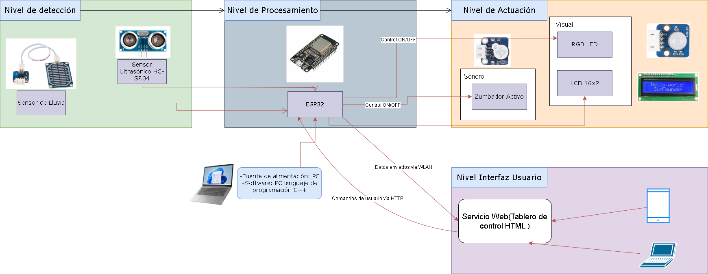
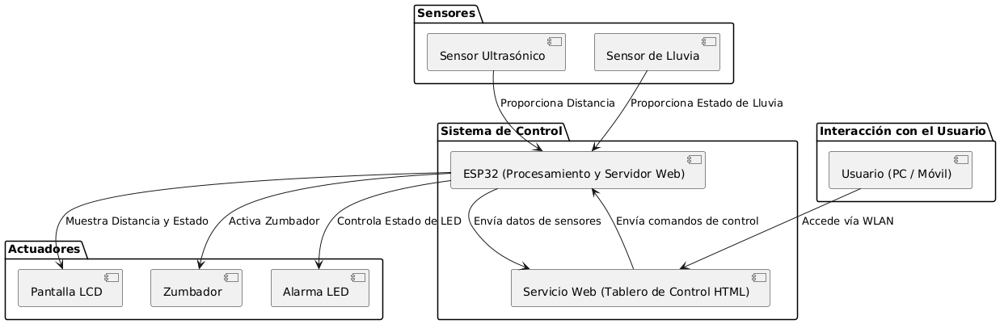
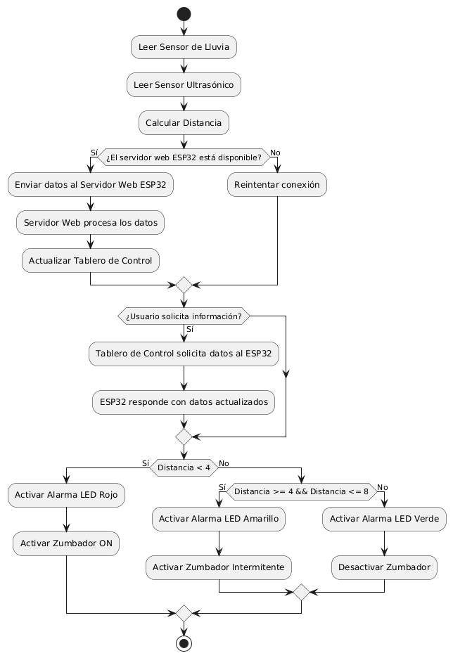
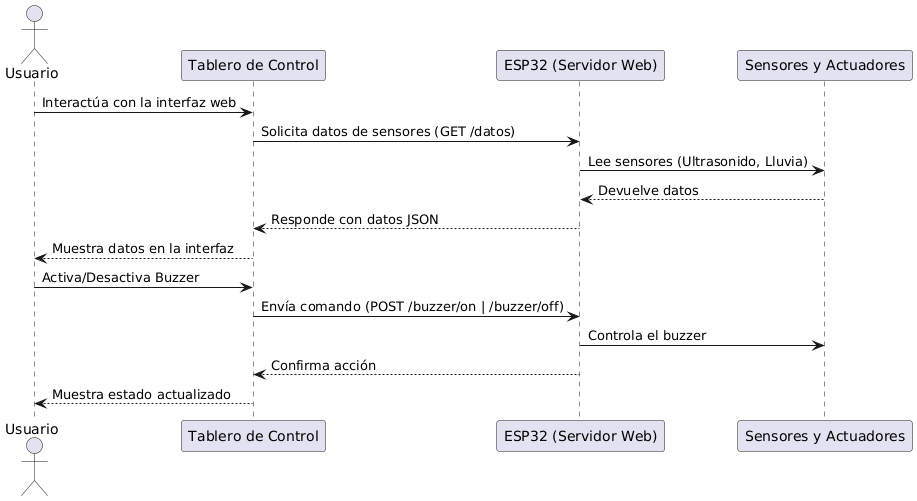
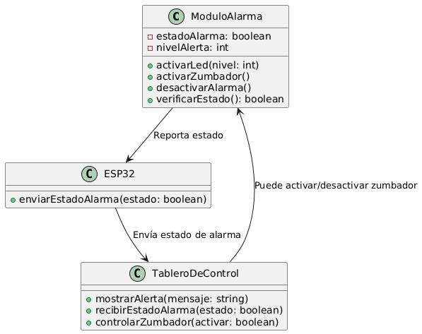
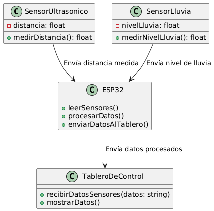
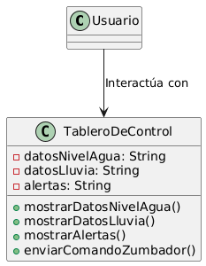
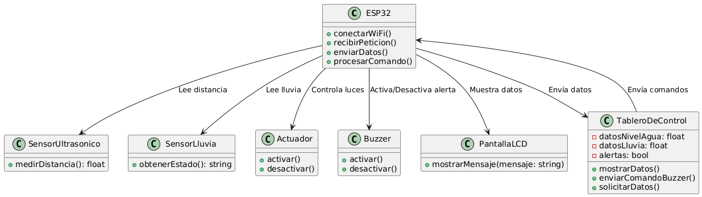

# Challenge2IoT
Made by Juan Pablo Corral and Juan Esteban Ocampo
## 1. Resumen general, motivación, justificación y estructura de la documentación
### Resumen general
Colombia es un país con una diversidad geográfica y sus patrones climáticos que cambian constantemente, se enfreta con bastante frecuencia a crecidas de ríos, especialmente en las temporadas de lluvias y de fenómenos como "La Niña". Esto provoca inundaciones que pueden tener un impacto negativo en la comunidades y en la infraestructura, como ocurrió en 2024 en Bogotá y en otras regiones del País.[1]

Este proyecto se centra en desarrollar un prototipo de sistema IoT (Internet of Things) para monitorear en tiempo real el nivel del agua en los ríos y detectar posibles crecidas de manera temprana. A diferencia del primer prototipo, este sistema permite a las autoridades acceder a la información de las variables físicas y recibir notificaciones de eventualidades a través de un "tablero de control" alojado en un servidor web embebido y accesible desde un navegador web (PC o teléfono celular) conectado a la WLAN. El sistema utiliza un microcontrolador ESP32 [2] y sensores ultrasónicos y de lluvia para medir el nivel del agua y las precipitaciones. En caso de detectar un aumento peligroso en el nivel del río, el sistema genera alertas visuales (LED RGB) y auditivas (zumbador) in situ, y además, notifica a las autoridades a través del tablero de control.  El tablero de control muestra el valor actual e histórico reciente de las variables físicas de interés, y permite la desactivación de alarmas físicas.

Este prototipo es un segundo paso hacia la implementación de un sistema de alerta temprana que podría ayudar a proteger a las comunidades y mitigar daños ocasionados por las inundaciones.

### Motivación
Las crecidas de los rión en Colombia representan una amenza constante, con unas posibles consecuencias que pueden ser devastadoras. Además de posibles muertes, este tipo de desastres pueden ocasionar la destrucción de viviendas, dañar infraestructuras y afectar la economía de las comunidades.

Por esto mismo, es fundamental contar con medidas de prevención y mitigación que ayuden a reducir estos riesgos. La implementación de sistemas de IoT de monitoreo en tiempo real permite detectar crecidas con antelación, brindando alertas tempranas tanto a las autoridades como a la población. En este contexto, un "tablero de control" accesible de forma remota se convierte en una herramienta esencial para que las autoridades puedan tomar decisiones informadas e implementar medidas preventivas de manera efectiva, salvando vidas y minimizando los daños materiales.

### Justificación

Este proyecto busca abordar el problema de las crecidas de ríos proporcionando información y alertas tempranas y precisas sobre los niveles de agua. Gracias al uso de sensores ultrasónicos y de lluvia, el sistema puede medir el nivel del agua y detectar cambios repeninos que indiquen un posible riesgo de inundación.

Una de las principales ventajas es la capacidad de emitir alertas visuales y sonoras, directamente en el lugar, permitiendo asi advertir a las personas cercanas y autoridades necesarias, incluso si no se tiene acceso a internet o a otros medio de comunicación. Además de la emisión de alertas visuales y sonoras in situ, para advertir a las personas cercanas, este prototipo incorpora un "tablero de control" accesible a través de la WLAN.  Esto permite a las autoridades locales monitorear en tiempo real las variables físicas de interés, recibir notificaciones de eventualidades y desactivar alarmas físicas de forma remota.  Esta capacidad es especialmente útil para comunidades en zonas remotas o de difícil acceso, donde la comunicación puede ser limitada.  

En resumen, el sistema facilita el monitoreo continuo tanto para la población como para las autoridades, contribuyendo a una mejor preparación y respuesta ante posibles emergencias.

### Estructura de la documentación
Este documento técnico describe el diseño, desarrollo, implementación y validación del prototipo del sistema IoT para el monitoreo de crecidas. La documentación se organiza de la siguiente manera:

*    Sección 2: Solución propuesta. Se presentan las restricciones de diseño, la arquitectura del sistema (tanto en hardware como en software), el desarrollo teórico modular y los estándares utilizados en el diseño con especial énfasis en el diseño e implementación del servidor web embebido y el tablero de control.
*    Sección 3: Configuración experimental, resultados y análisis. Se describe el entorno de prueba incluyendo la configuración para probar el acceso y funcionamiento del tablero de control desde diferentes dispositivos, los resultados obtenidos y el análisis de los datos recopilados.
*    Sección 4: Autoevaluación del protocolo de pruebas. Se evalúa la efectividad del protocolo de pruebas implementado y se propones posibles mejoras.
*    Sección 5: Conclusiones, retos, trabajo futuro y referencias. Se resumen los principales logros del proyecto, los desafíos enfrentados durante su desarrollo, las oportunidades de mejora y las referencias bibliográficas utilizadas.
*    Sección 6: Anexos. Se incluyen el código fuente, los esquematicos del sistema y otro material complementario.
*    Sección 7: Video demostrativo. Se presenta un video explicativo que muestra el funcionamiento del prototipo en acción.

## 2. Solución Propuesta
### Restricciones de diseño identificadas
El desarrollo del prototipo de sistema de IoT para el monitoreo de crecidas estuvo sujeto a diversas restriscciones de
diseño las cuales se presentan a continuación:

#### Técnicas:

*   **Rango del sensor ultrasónico:** El sensor HC-SR04 tiene un rango de medición de 2 cm a 400 cm [3]. Debido a las limitaciones del tamaño del recipiente en el que se efectuaron las pruebas, se mapeó el rango de la siguiente forma: Cada centímetro detectado por el sensor representaba un metro en la escala de un río real. Por lo tanto, una distancia medida de 7 cm por el sensor ultrasónico se consideró como el umbral de "Nivel Normal" (equivalente a 7 metros en el río real). Una distancia de 4 cm medida por el sensor se consideró como el umbral de "Posible Crecida" (equivalente a 10 metros en el río real). Distancias menores a 4 cm se consideraron como "Peligro". Esta escala se implementó en el código de la ESP32 para definir los umbrales de control.[4][5] El trabajo futuro podría explorar sensores con mayor alcance para monitorear ríos más grandes o con variaciones de niveles más sutiles.
*    **Limitaciones de la pantalla LCD:** La pantalla LCD 16x2 solo puede mostrar una cantidad limitada de caracteres y/o símbolos,
lo que restringe cuanta información al tiempo se pude evidenciar.
*   **Rendimiento del servidor web embebido:** El microcontrolador ESP32 tiene recursos limitados memoria, capacidad de procesamiento, lo que impone restricciones en el número de usuarios concurrentes que pueden acceder al tablero de control y en la complejidad de la interfaz web. [1]
*   **Conectividad WLAN:** La fiabilidad de la conexión WLAN puede verse afectada por la distancia al punto de acceso, la presencia de obstáculos y las interferencias.[6]

#### Disponibilidad
*    **Solo uso de los sensores en aula de clase:** Dado que los dispositivos y los sensores son parte de la universidad,
estos solo estaban disponibles en el horario de clases o un horario permitido dentro de la universidad.

#### De Espacio

*    **Tamaño compacto:** El diseño deber fácil de instalar y transportar.

#### Escalabilidad

*    **Expansión:** Diseñado para monitorear un solo punto, pero con posibilidad de escalar a múltiples ubicaciones. Además
con posibilidad de incluir sensores mas precisos y con diferentes tecnologías para un rio de verdad.

#### Tiempo
*    **Tiempo limitado para el desarrollo:** El tiempo disponible para el desarrollo e implementación del prototipo fue
limitado, dado que los sensores solo estaban disponibles en horario de clase o horario permitidos dentro de la universidad
lo que requirió priorizar funcionalidades y el proceso de diseño y construcción.

#### Seguridad

*   **Seguridad del acceso al tablero de control:** Se deben implementar mecanismos de seguridad para restringir el acceso al tablero de control solo a usuarios autorizados (por ejemplo, mediante autenticación).
*   **Protección de datos:** Se deben proteger los datos transmitidos entre el microcontrolador y el tablero de control para evitar su interceptación o manipulación.

#### Compatibilidad:
*   **Compatibilidad con navegadores web:** El tablero de control debe ser compatible con los navegadores web más comunes (por ejemplo, Chrome, Firefox, Safari) y con diferentes dispositivos (PC, teléfono celular).

### Arquitectura propuesta

#### Diagrama de bloques de Hardware

#### Diagrama de bloques de Software

### Interfaces conexion sensores y actuadores:

* **LCD 16x2:**
    * RS pin: Arduino pin 2
    * Enable pin: Arduino pin 3
    * D4 pin: Arduino pin 7
    * D5 pin: Arduino pin 8
    * D6 pin: Arduino pin 9
    * D7 pin: Arduino pin 10
* **Sensor ultrasónico (HC-SR04):**
    * TRIG pin: Arduino pin 13
    * ECHO pin: Arduino pin 12
* **LED (Verde):**
    * Pin del LED: Arduino pin 6
* **LED (Rojo):**
    * Pin del LED: Arduino pin 5
* **LED (Azul):**
    * Pin del LED: Arduino pin 4
* **Zumbador:**
    * Pin del zumbador: Arduino pin 11
* **Sensor de lluvia (SunFounder):**
    * Pin analógico: Arduino pin A0

### Desarrollo teórico modular
Para construir el prototipo, se adoptó un enfoque modular, estructurando el sistema en componentes con funciones específicas para facilitar su diseño y funcionamiento.

*   **Sensor de lluvia SunFounder:** Se eligió un sensor capaz de detectar la presencia de lluvia con la sensibilidad adecuada para activar el sistema de alerta en caso de ser necesario. El sensor funciona detectando cambios en la conductividad eléctrica cuando el agua entra en contacto con las pistas conductoras. El sensor entrega valores comprendidos entre 0 y 1023, donde 0 indica ausencia de agua, y 1023 es un valor de completa saturación de agua. Estos valores son escalados por medio del Arduino para representar los estados; SIN LLOVIZNA, LLOVIZNA, LLUVIOSO, TORMENTA. Por ejemplo, valores entre 0 y 255 se consideraron "SIN LLOVIZNA", valores entre 256 y 511 se consideraron "LLOVIZNA", valores entre 512 y 767 se consideraron "LLUVIOSO", y valores entre 768 y 1023 se consideraron "TORMENTA".[7]
*    **Sensor ultrasónico:** Se utilizó el modelo HC-SR04 debido a su precisión y rango de medición, lo que permite determinar el nivel del agua dentro de un rango relevante.[1]
*    **Alarma(LED RGB y zumbador):** Se diseñó una alarma que combina señales visuales (LED RGB) y sonoras (zumbador) para alertar sobre la situación. La luz verde significa seguro, la luz azul más el sonido intermitente significa precaución y por último la luz roja más el sonido continuo representa peligro.
*    **Pantalla LCD 16x2:** Se configuró una pantalla LCD 16x2 para mostrar de manera clara y concisa información en tiempo real, incluyendo el nivel agua y el estado del sistema.
*   **Servidor Web Embebido:**  Se implementó un servidor web en el ESP32 para proporcionar acceso a los datos del sistema a través de una red WiFi. El servidor expone puntos finales para recuperar los datos del sensor y controlar el zumbador. El servidor web expone las siguientes rutas (URLs): /datos: Para acceder a los datos actuales de los sensores (nivel del agua, estado de la lluvia). /history: Para acceder al historial de datos de los sensores, permitiendo visualizar la evolución del nivel del agua y la lluvia a lo largo del tiempo. /buzzer/on: Para activar el zumbador de forma remota. /buzzer/off: Para desactivar el zumbador de forma remota.
*   **Tablero de Control (Interfaz Web):** Se desarrolló una interfaz web utilizando HTML, CSS y JavaScript para visualizar los datos del sistema y permitir la interacción del usuario. El tablero de control se estructura de la siguiente manera: 1. Visualización de datos actuales: Se muestran en tiempo real el nivel del agua, el estado de la lluvia y el estado de alerta del sistema 2. Visualización del historial de datos: Se presentan gráficas interactivas que muestran el historial del nivel del agua y la lluvia, permitiendo al usuario analizar la evolución de estas variables 3. Notificaciones y alertas: Se muestran notificaciones visuales en caso de que el nivel del agua alcance niveles de precaución o peligro. 4. Control del zumbador: Se proporcionan botones para activar y desactivar el zumbador de forma remota.

Este tipo de diseño modular le permite a cada componente cumplir una función específica, mejorando la eficiencia y facilidad de mantenimiento del sistema. La inclusión de un servidor web y un tablero de control permite el monitoreo remoto y la interacción con el sistema a través de una red WiFi.

### Diagrama de UML

#### Diagrama de Flujo

#### Diagrama de Secuencia

#### Diagrama del Modulo de Alarma

#### Diagrama del Modulo de Sensores

#### Diagrama Interfaz de Usuario

#### Diagrama del Sistema Completo

### Esquemático de Hardware

### Estándares de diseño de ingeniería aplicados

El diseño de este prototipo de sistema de alerta temprana se basó en los siguientes estándares y principios de diseño de ingeniería:

*    **Diseño Centrado en el Humano (ISO 9241-210):** Se aplicaron los principios de esta norma para asegurar que el sistema fuera fácil de usar y comprender para los usuarios finales. Esto se manifestó en:
1. Visualización clara y concisa de la información tanto en la pantalla LCD como en el tablero de control web, mostrando el nivel del agua y el estado del sistema de manera que se pueda entender rápidamente.

2. Alertas visuales y auditivas diseñadas para ser perceptibles en diferentes entornos. El LED RGB proporciona una alerta visual que es fácilmente visible tanto de día como de noche, mientras que el zumbador emite una alerta audible que es claramente audible incluso durante el día.

3. Diseño intuitivo del tablero de control, que permite a los usuarios acceder a la información relevante y controlar el sistema de forma sencilla.

*   **Diseño Modular:** El sistema se estructuró en módulos independientes para mejorar la mantenibilidad, la escalabilidad y la reutilización del código. Cada módulo (sensor de lluvia, sensor ultrasónico, alarma, pantalla LCD, servidor web) tiene una función específica y bien definida, lo que facilita la identificación y corrección de errores, así como la adición de nuevas funcionalidades en el futuro.

*   **Confiabilidad y Robustez:** Se seleccionaron componentes y técnicas de medición confiables para garantizar que el sistema funcione de manera precisa y consistente en diferentes condiciones. Por ejemplo, el sensor ultrasónico HC-SR04 es conocido por su precisión en la medición de distancias, y el uso de un microcontrolador ESP32 proporciona una plataforma robusta para el procesamiento de datos y la comunicación.

###   Criterios de diseño establecidos

Se establecieron los siguientes criterios de diseño para guiar el desarrollo y la evaluación del prototipo:

*   Precisión en la detección del nivel de agua: El sistema debe medir con precisión la distancia entre el sensor y el nivel del agua.
*   Fiabilidad en la generación de alertas: El sistema debe generar alertas de forma fiable (visual y audible) cuando el nivel del agua alcanza umbrales predefinidos.
*   Claridad en la visualización de la información: La pantalla LCD debe mostrar la información de forma clara y concisa, comprensible para los usuarios.
*   Rentabilidad: El sistema debe diseñarse utilizando componentes fácilmente disponibles y asequibles.
*   Facilidad de montaje: El sistema debe ser relativamente fácil de montar y mantener.

## 3.Configuración experimental, resultados y análisis
### Descripción del entorno de prueba
Las pruebas se llevaron a cabo en el laboratorio de electrónica de la Universidad de la Sabana, un ambiente interior controlado y libre de condiciones climáticas externas que pudieran afectar los resultados.

Para la realización de las pruebas, se utilizaron los siguientes equipos y materiales:
*    Sensor ultrasónico HC-SR04
*    Sensor de lluvia SunFounder
*    Arduino Uno
*    Jumpers
*    Protoboard
*    LED RGB
*    Zumbador Activo
*    Resistencias de 1k y 220 ohmnios
*    Termo y envase (Utilizados para simular la lluvia)
*    Recipiente plástico (Utilizado para simular un río)

Cabe recalcar que para estas pruebas, el estado seguro de río está para 7 o más centímetros de distancia del sensor, el estado de precaución está entre 6 y 5 centímetros de distancia y por el último el estado de peligro es para menos de 5 centímetros. Y Para el sensor hay 4 estados, sin llovisna, llovisna, lluvioso y tormenta.

### Procedimiento
1.  Montaje del prototipo: Se conectaron todos los componentes (sensores, Arduino, LED RGB, zumbador) en la protoboard siguiendo el esquemático de hardware.
2.  Carga del programa: Se cargo el programa Arduino a través del puerto USB y con la laptop.
3.  Preparación del entorno: Se llenó el recipiente plástico con agua hasta un nivel inicial considerado seguro. Se midió la distancia entre el sensor ultrasónico y el nivel del agua, resgitrando el valor como punto de referencia.
4.  Simulación de lluvia: Utilizando el termo y el envase, se vertió agua de forma gradual en el recipiente para simular de esta manera la lluvia y aumentar el nivel del agua, para así observar los cambios de estado del sistema.
5.  Observación y registro: Se observó el comportamiento del LED RGB y el zumbador a medida que el nivel del agua se elevaba. Al mismo tiempo, la LCD brindó la información correcta. Se regisrtró la distancia medida por el sensor ultrasónico en el que se producian las transiciones entre los estados (seguro, precaución y peligro).

### Resultados
| Nivel del Agua (distancia entre sensor y el agua) cm | Color del LED RGB | Zumbador             | Estado en pantalla LCD | Estado de lluvia |
| :------------------------------------------------- | :--------------- | :------------------- | :-------------------- |:-------------------- |
| 10                                                 | Verde            | No está sonando       | SEGURO                | SIN LLOVIZNA            |
| 9                                                  | Verde            | No está sonando       | SEGURO                | SIN LLOVIZNA            |
| 8                                                  | Verde            | Sonido Intermitente   | SEGURO                | SIN LLOVIZNA            |
| 7                                                  | Verde            | Sonido Intermitente   | SEGURO                | LLOVIZNA                |
| 6                                                  | Azul             | Sonido Intermitente   | PRECAUCION            | LLUVIOSO                |
| 5                                                  | Azul             | Sonido Intermitente   | PRECAUCION            | LLUVIOSO                |
| 4                                                  | Rojo             | Sonido Constante      | PELIGRO               | LLUVIOSO                |
| 3                                                  | Rojo             | Sonido Constante      | PELIGRO               | TORMENTA                |
| 2                                                  | Rojo             | Sonido Constante      | PELIGRO               | TORMENTA                |

### Análisis
Los resultados obtenidos demuestran que el prototipo es capaz de dectectar cambios en el nivel del agua debido a las precipitaciones, y alertar al usuario mediante señales visuales (LED RGB) y sonoras (zumbador).

Específicamente, se comprobó que:

*    El sistema identifica de manera correcta un estado de agua seguro (LED verde, zumbador inactivo) (+8cm).
*    Ante un aumento simulado del nivel del agua, el sistema transiciona a un estado de precaución (LED azul, zumbador intermitente) (entre 8cm y 4cm).
*    Al alcanzar un estado de peligro, el sistema emite una alerta clara (LED rojo, zumbador continuo) (-4cm).
*    El sistema detecta el estado de las precipitaciones (SIN LLOVIZNA, LLOVIZNA, LLUVIOSO, TORMENTA).

Es importante recalcar que después de diversas pruebas es recomendable realizar las otras pruebas en condiciones de lluvia reales para validar el comportamiento del sistema. Sin embargo, en estas condiciones simuladas el sistema mostró ser capaz de detectar posibles crecidas de ríos (nivel del agua en el recipiente).

## Autoevaluación del protocolo de pruebas
### Evaluación de la efectividad del protocolo
* ¿El protocolo permitió validar correctamente el funcionamiento del prototipo? Sí, el protocolo de pruebas implementado permitió validar de manera efectiva el funcionamiento básico del prototipo. Se realizaron pruebas en distintos escenarios de nivel de agua, permitiendo observar como el sistema respondía mediante el LED RGB, el zumbador y la pantalla LCD. Los resultados confirmaron que el prototipo dertecta cambios en el nivel del agua y alerta in situ de acuerdo a los umbrales establecidos.
* ¿Se identificaron todos los posibles escenarios de uso? Aunque el protocolo permitió evaluar el funcionamiento general, no se consideraron todas las situaciones que podrían pasar en un entorno real. Por ejemplo, las pruebas se realizaron en un ambiente controlado y no se simularon condiciones climáticas extremas como lluvia intensa o ventiscas, oleaje en el río entre otras, que podrían afectar el rendimiento del sensor de lluvio o la precisión del sensor ultrasónico. Tampoco se evaluarion escenarios deonde el nivel del agua desciende abruptamente o fluctúa de manera irregular.

### Posibles mejoras al protocolo de pruebas
Para tener una evaluación más completa del prototipo, sería recomendable incluir las siguientes pruebas:

*    Pruebas en condiciones climáticas reales: Evaluar el desempeño del sistema en exteriores bajo lluvia real para verificar la fiabilidad del sensor de lluvia y la resistencia del prototipo a factores ambientales.
*    Pruebas con distintas intesidades de lluvia: Utilizar un pluviómetro para medir la cantidad de la lluvia y analizar su impacto en la detección del nivel del agua.
*    Pruebas con variaciones rápidas del nivel del agua: Simular situaciones en las que el agua sube o baja rapidamente para verificar que tan bien responde el sistema a variaciones repentinas.
*    Pruebas de duración: Dejar el prototipo funcionando de manera continua por varios días para detectar posbiles fallos a largo plazo y evaluar su confiabilidad.

## Conclusiones retos presentados durante el desarrollo del proyecto, trabajo futuro y referencias.

### Conclusiones

El desarrollo de este prototipo de sistema IoT para la detección temprana de crecidas de ríos permitió demostrar la viabilidad de utilizar sensores y Arduino en la prevención de desastres naturales. A través de la implementación del sensor ultrasónico y a el sensor de lluvia SunFpunder, fue posible monitorear en tiempo real en nivel del agua y generar alertas visuales y sonoras en caso de peligro.

Entre los principales logros del proyecto se destacan:

*  La correcta integración de los sensores con el Arduino uno, logrando un monitoreo eficiente.
*  La implementación de una señal de alerta clara y perceptible mediante un LED RGB y un zumbador.
*  La visualización en tiempo real de los datos en la pantalla LCD 16x2 proporcionando información accesible sobre el estado del sistema.
*  Un diseño modular que permite futuras mejoras y adaptaciones para su implementación en escenario reales.

Este proyecto es un primer paso en la dirección correcta hacia el desarrollo de sistemas de alerta temprana accesibles y económicos. La implementación de este tipo de tecnologías prodría reducir significativamente los impactos de las inundaciones, protegiendo tanto a la población como a la infraestructura.

### Retos Presentados durante el desarrollo del proyecto

A lo largo del desarrollo del prototipo, se enfrentaron diversos desafíos:

*    Precisión del sensor ultrasónico
*    Limitaciones en el tiempo de desarrollo
*    Condiciones controladas
*    Espacio reducido
*    Interfaz limita

### Trabajo futuro
Este prototipo podría estar sentando varias bases para un sistema más avanzado que pude ser implementado en ríos reales. Alguna mejoras futuras podrían ser:

*    Integración con redes IoT: Conectar el sistema a plataformas en la nube para permitir el monitoreo remoto y la notificación de alertas a través de aplicaciones móviles o SMS.
*    Autonomía energética y sostenibilidad: Implementar un sistema completo de paneles solaras para garantizar el funcionamiento continuo del sistema en ubicaciones remotas.
*    Resistencia a condiciones ambientales: Diseñar una carcasa empermeable y resistente para que de esta manera se puedan proteger los componentes electrónicos de condiciones adversas.
*    Alcance: Hacer posible el despliegue de varias unidades en diferentes ubicaciones para obtener una red de monitoreo más sofisticada.

### Referencias
[1] J. E. Neira, «La empresa de acueducto reveló las razones por las que se están inundando las calles de Bogotá», Infobae, 15 de noviembre de 2024. Disponible en: https://www.infobae.com/colombia/2024/11/15/la-empresa-de-acueducto-[2] revelo-las-razones-por-las-que-se-estan-inundando-las-calles-de-bogota/
www.alldatasheet.es, «ESP32 datasheet(1/60 Pages) ESPRESSIF», 32-bit MCU & 2.4 GHz Wi-Fi & BT/BLE SoCs. https://www.alldatasheet.es/html-pdf/1148023/ESPRESSIF/ESP32/564/1/ESP32.html
[3] HC-SR04 Ultrasonic Sensor Datasheet. Handson Technology. https://www.handsontec.com/dataspecs/HC-SR04-Ultrasonic.pdf
[4] «Informe Niveles Río Cauca del 6 de abril de 2023 Hora 5:00 p.m | Ecopedia la enciclopedia ambiental del Valle del Cauca». Disponible en: https://portal-hidroclimatologico.cvc.gov.co/content/informe-niveles-rio-cauca-del-6-de-abril-de-2023-hora-500-pm
[5] «Precipitación: ¿Cuándo es poco y cuándo es mucho? | Eltiempo.es», Eltiempo.es, 6 de marzo de 2024. Disponible en: https://www.eltiempo.es/noticias/precipitacion-cuando-es-poco-y-cuando-es-mucho
[6] J. Mrázek, «Testing the WiFi range of ESP32 - mind.dump()», mind.dump(), 13 de agosto de 2017. https://blog.honzamrazek.cz/2017/08/testing-the-wifi-range-of-esp32/
[7] «Lesson 14 Rain Detection Module — SunFounder SunFounder_SensorKit_for_RPi2  documentation». Disponible en: https://docs.sunfounder.com/projects/sensorkit-v2-pi/en/latest/lesson_14.html
Unidad Nacional para la Gestión del Riesgo de Desastres (UNGRD). (2020). Sistemas de Alerta Temprana como elementos para la gestión del riesgo de desastres. Portal Gestión del Riesgo. https://portal.gestiondelriesgo.gov.co/Paginas/Noticias/2020/Sistemas-de-Alerta-Temprana-como-elementos-para-la-gestion-del-riesgo-de-desastres.aspx
